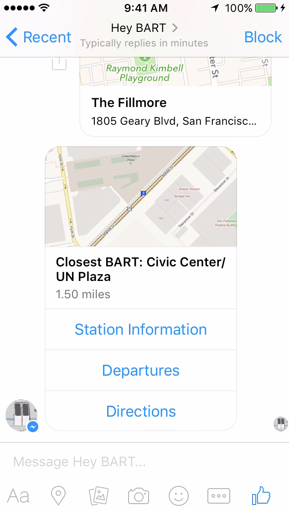

# BART Chat Bot for Facebook Messenger

Facebook Messenger chat bot for BART (Bay Area Rapid Transit).

Implemented using Node JS, and can be hosted anywhere that meets the following criteria:

* Accessible from the internet
* Uses SSL (Facebook requires bots to use SSL)

I have been running this using the AWS Elastic Beanstalk hosting environment, and am using Cloudflare to provide SSL.

Cloudflare is set up for the domain that I am hosting the bot on, there's a DNS CNAME pointing:

bartfbsecurechatbot.mydomain.mytld

to the AWS Elastic Beanstalk instance that the bot runs on.

As Cloudflare sits in front of that DNS CNAME I can use their free SSL, and configure the Facebook platform to see my bot at an SSL protected URL.

Communications between Cloudflare and Elastic Beanstalk remain via regular HTTP for now, and this isn't something you should do in production where you want SSL enabled hosting.

## Video

The bot isn't publically available as I haven't submitted it to Facebook for approval, nor scaled the infrastructure to operate as internet scale.  It's more of a coding exercise / demo than something I would put into production long term.

To see a YouTube video of the bot working, click the screenshot below.

[](https://www.youtube.com/watch?v=_zUNHfDCsDk "Hey BART Bot")

## BART API

This project uses my BART JSON API:

* [GitHub Repo](https://github.com/simonprickett/bartnodeapi)
* [Running Instance used by this project to get data from BART](http://bart.crudworks.org/api)

This in turn makes calls out to the real BART API, which returns XML.  I decided a while back that I wanted a JSON based API, so wrote my own conversion layer which is what I am talking to from the bot in this project.

Right now I am not using the API call to get the route and price for a journey between two stations, but I aim to add that in future.

## Bot Backend Node JS Application Initial Setup

We can write the bot's backend in anything that can live on a SSL URL, receive HTTP requests and respond to them.  As all of the requests would be coming from Facebook, we may need to consider making sure our hosting choices scale.  

AWS Lambda would potentially be a good option for this.  As I wanted to learn about Facebook Messenger bots with minimum other distractions, I went with AWS Elastic Beanstalk and Node JS as I am familiar with scaffolding applications quickly there, and don't intend putting my bot into production use.

To keep things simple, I used the popular [Express](http://expressjs.com/) web framework and [Request](https://www.npmjs.com/package/request) HTTP client for making calls to the BART JSON API endpoints.

We need to get something basic running in order to register a webhook with the Facebook platform in the next step.

As part of the initial handshake with the Facebook platform, our application needs to respond to a GET request to `/webhook/`, verify a validation token and reply with a "challenge" value that Facebook sends in the request.

Pick a validation token - for example "super_secret_squirrel", then deploy an application that contains the following route somewhere that it can be accessed at a HTTPS URL:

```javascript
app.get('/webhook/', function (req, res) {
  if (req.query['hub.verify_token'] === 'super_secret_squirrel') {
    res.send(req.query['hub.challenge']);
  }
  res.send('Error, wrong validation token');
})
```

Facebook documentation on this can be found [here](https://developers.facebook.com/docs/messenger-platform/quickstart).

Before adding any more logic to the application, we need to do some setup on the Facebook platform.

## Initial Facebook Setup

For this exercise, we'll need to create a Facebook Page and App for the bot.  I'm assuming you are familiar with the [Facebook Developer Portal](https://developers.facebook.com/) so won't cover this in step by step detail.  

The Facebook documentation for creating a Messenger bot can be found [here](https://developers.facebook.com/docs/messenger-platform).

### Create a Facebook Page

Create a new Facebook Page to use with the bot, or use one you already have.

For testing a bot, this doesn't have to be a published page.  The bot wil use the profile pic from your page as its avatar in Messenger conversations.

If you're going to run your bot in pre-release / sandbox mode, then you'll want to make your Facebook friends whom you also want to be able to use the bot editors of your unpublished page, as they won't be able to see it otherwise.

### Create a Facebook App

You will need a new Facebook App for your bot, and you can keep it in sandbox mode.  When creating a new app, add the "Messenger" product. Facebook documentation for each of these steps can be found [here](https://developers.facebook.com/docs/messenger-platform/quickstart).

### Set Callback URL and Verify Token

You will be asked for a Callback URL, set this to the full HTTPS URL for your Node application's webhook route e.g:

```
https://whatever.something.com/webhook
```
You will also need to add your verification token ('super_secret_squirrel' from the webhook code we wrote earlier) into the dialog that appear, and check the boxes to subscribe to:

* `message_deliveries`
* `messages`
* `message_optins`
* `messaging_postbacks`

### Generate Page Token

In the Messenger properties page for your app, there's a Token Generation section.  Select the page that you created earlier from the "Page" drop down.  When the token appears, copy that as it will be needed for the next step.

### Subscribe the App to the Facebook Page

To associate your app with the Facebook page for the purposes of receiving updates from it, run the following at the command line on your local machine.

```
curl -X POST "https://graph.facebook.com/v2.6/me/subscribed_apps?access_token=<FACEBOOK_PAGE_ACCESS_TOKEN>"
```

Substitute `<FACEBOOK_PAGE_ACCESS_TOKEN>` for the token that was generated in the previous step.

You should now have things setup so that messages sent to your page from Facebook users are routed to the Node application for processing.

## Adding Logic to the Node Backend

The Node backend application now needs to be modified to receive and process messages from the Facebook platform, and respond with appropriately formatted JSON replies that Facebook will render as messages to the user from the bot.

The Facebook platform communicates with the bot using a single `POST` route to `/webhook/`, so we need to add a handler for that to our Node/Express application.

Facebook provides some boilerplate code for this that looks like this:

```javascript
app.post('/webhook/', function (req, res) {
  messaging_events = req.body.entry[0].messaging;
  for (i = 0; i < messaging_events.length; i++) {
    event = req.body.entry[0].messaging[i];
    sender = event.sender.id;
    if (event.message && event.message.text) {
      text = event.message.text;
      // Handle a text message from this sender
    }
  }
  res.sendStatus(200);
});
```

This will receive a message (or array of - Facebook can batch incoming messages together if traffic on the system is high), then get the text of the message out of the incoming request.  You then need to add your own code to do something with that text (parse it for keywords for example) and return a response JSON object that Facebook will render back to the user.

In my bot, I'm handling more than just the basic text messages that the Facebook example code caters for: I'm looking for messages with a location attachment (user has sent their location from Messenger to the bot), and postback messages from previous button presses that the user made on calls to action that the user took when dealing with replies from the bot.  So my logic for processing incoming messages from Messenger looks like:

```javascript
app.post('/webhook/', function (req, res) {
    var messagingEvents, 
        i = 0,
        event,
        sender,
        text,
        attachment;

    if (req.body && req.body.entry) {
        messagingEvents = req.body.entry[0].messaging;

        for (; i < messagingEvents.length; i++) {
            event = messagingEvents[i];
            sender = event.sender.id;
            if (event.message && event.message.attachments && event.message.attachments.length > 0) {
                attachment = event.message.attachments[0];

                if (attachment.type === 'location') {
                    processLocation(sender, attachment.payload.coordinates);
                }
            } else if (event.postback && event.postback.payload) {
                if (event.postback.payload.indexOf('departures') > -1) {
                    processMessage(sender, event.postback.payload);
                }
            } else {
                if (event.message && event.message.text) {
                    text = event.message.text;
                    processMessage(sender, text);
                }
            }
        }
    }

    res.sendStatus(200);
});
```

Note we always send a 200 status back to Facebook as soon as possible - the response message will be sent as a separate `POST` asychronously.

We'll cover each of the incoming message types in detail, but we're looking for:

* Text message: `event.message.text`
* Postback action (call to action button pressed): `event.postback.payload`
* Location sent: `event.message.attachments[0].type === 'location'`

Then we deal with each using their own function.

## Responding to Messages from Users

Now we can read messages from users, we need to do something with them and send an appropriate response back.

The Messenger platform supports some basic response types, which are:

* A text message (plain text)
* A URL to an image (not used in this example)
* An image file (not used in this example)
* A call to action with postback action buttons or links to external websites
* A structured message containing one or more "bubbles", each containing text, optional image and optional calls to action links.  "bubbles" scroll horizontally in the user's view in Messenger
* A structured message containing a receipt for goods (not used in this example)

The message types are all quite basic, represented as JSON, and have little to no formatting options.  More information and example JSON schemas for each can be found in the [Send API Reference documentation](https://developers.facebook.com/docs/messenger-platform/send-api-reference).

The API is not designed for long replies, the currenct limitations are:

* Title field: 45 characters
* Subtitle field: 80 characters
* Call to action button title: 20 characters
* Maximum call to action items per bubble: 3
* Maximium bubbles per message response: 10 (will scroll horizontally)

Text appears to have little to no formatting options (seemingly no way to do an unordered or ordered list.  `\n` does cause a line break).

If a message has a text field in it that contains more than the allowed number of characters, Facebook will reject it.

### Responding to Text Messages

When we receive a text message (identified by a `POST` to `/webhook/` containing):

```javascript
event.message.text
```

everything that the user typed is delivered as a single string in the above property.

We can then use any sort of string parsing to try and work out what the user is asking for, and send any type of response message (plain text, one or more bubbles of text / image / link / call to action buttons).

In this demo, we're using basic string searches to determine the user's query.  Ugly, but effective enough to pick out what we need:

```javascript
function processMessage(sender, reqText) {
    var respText = 'Sorry I don\'t understand. Try:\n\nstatus\nelevators\nstations\ndepartures <code>\n\nOr send your location for nearest station.',
        keywordPos = -1,
        stationCode;

    reqText = reqText.trim().toLowerCase();

    if (reqText.indexOf('help') > -1) {
        // Deal with sending user help message
    } else if (reqText.indexOf('stations') > -1) {
        // Get a list of all station codes and send them to the user
    } else if (reqText.indexOf('departures') > -1) {
        // Parse out a station code from:
        // departures from <code>
        // departures for <code>
        // departures at <code>
        // departures <code>

        keywordPos = reqText.indexOf('departures at');
        if (keywordPos > -1 && reqText.length >= keywordPos + 18) {
            stationCode = reqText.substring(keywordPos + 14, keywordPos + 18);
        } else {
            keywordPos = reqText.indexOf('departures for');
            if (keywordPos > -1 && reqText.length >= keywordPos + 19) {
                stationCode = reqText.substring(keywordPos + 15, keywordPos + 19);
            } else {
                keywordPos = reqText.indexOf('departures from');
                if (keywordPos > -1 && reqText.length >= keywordPos + 20) {
                    stationCode = reqText.substring(keywordPos + 16, keywordPos + 20);
                } else {
                    keywordPos = reqText.indexOf('departures');
                    if (reqText.length >= keywordPos + 15) {
                        stationCode = reqText.substring(keywordPos + 11, keywordPos + 15);
                    } else {
                        // Keyword found but no station code
                        keywordPos = -1;
                    }
                }
            }
        }

        if (keywordPos > -1) {
            stationCode = stationCode.trim();
            // Go get the train departures for the requested
            // station code and send to the user
        } else {
            // Send error message to user
        }
    } else if (reqText.indexOf('elevators') > -1) {
        // Get elevator status and send to the user
    } else if (reqText.indexOf('status') > -1) {
        // Get system status and service announcements
        // and send to the user
    } else {
        // Unknown command
        console.log(respText);
        sendTextMessage(sender, respText);
    }
}
```

For more complex text processing, Facebook recommends trying [wit.ai](https://wit.ai/).

#### Sending a Plain Text Response

In the case where we want to send a basic text reply (for example with the elevator status response that is just a short text message), we simply call a function `sendTextMessage` which expects the sender (from the original webhook call that came from the Facebook platform), and a string for the message to send back to that user:

```javascript
sendTextMessage(sender, 'Hello there!');
```

The implementation of `sendTextMessage` looks like this:

```javascript
function sendTextMessage(sender, text) {
    var messageData = {
        text: text
    };

    httpRequest({
        url: 'https://graph.facebook.com/v2.6/me/messages',
        qs: { 
            access_token: FACEBOOK_PAGE_ACCESS_TOKEN 
        },
        method: 'POST',
        json: {
            recipient: { 
                id: sender
            },
            message: messageData,
        }
    }, function(error, response, body) {
        if (error) {
            console.log('Error sending message: ', error);
        } else if (response.body.error) {
            console.log('Error: ', response.body.error);
        }
    });
}
```

This simple sends a HTTP `POST` to the Facebook Graph API (must be v2.6 or higher) to generate a message back to the user.  The `messageData` object simply wraps the plain text that we want to send.  We authenticate to Facebook using the Page Access Token that was obtained when setting up the bot.

If the message is over 320 characters, Facebook will reject it.

In other cases, we have more information than the 320 character limit of a text message allows for, and/or we want to format it to include multiple message "bubbles", images, header/sub-headers, links to websites or further calls to action.  For this we need to use Facebook's "Generic Template".

#### Sending a Richer Response

Strangely, Facebook uses the term "Generic Template" for its richer message template that can include between 1 and 10 "bubbles", each containing a title (45 characters), subtitle (80 characters), 3 buttons each having up to a 20 character label and linking to an external web page or a postback to the bot.

Again, the message bubble(s) are described by way of JavaScript objects and posted to the Facebook Graph API as JSON.

An example object that sends 3 bubbles each with a title and subtitle looks like this (we use this to return departure times from a given station):

```javascript
messageData = {
    attachment: {
        type: 'template',
        payload: {
            template_type: 'generic',
            elements: [
                {
                    title: '24th Street',
                    'subtitle': '43 mins, 9 cars. 58 mins, 9 cars. 73 mins, 9 cars.'
                },
                {
                    title: 'Daly City',
                    'subtitle': '43 mins, 9 cars. 58 mins, 9 cars. 73 mins, 9 cars. 1 min, 9 cars. 4 mins, 9 cars.'
                },
                {
                    title: 'Millbrae',
                    'subtitle': '8 mins, 4 cars. 23 mins, 4 cars. 38 mins, 4 cars. 13 mins, 5 cars.'
                }
            ]
        }
    }
};
```

Each object in the `elements` array becomes its own "bubble" when rendered in Messenger, and these scroll horizontally in the Messenger chat box.

We'll look at adding images and callback buttons when responding to location messages later.

When we have our object ready to send, we call a function `sendGenericMessage` which expects the sender (from the original webhook call that came from the Facebook platform), and an object containing the template for the message bubble(s) to send back to that user:

The implementation of `sendGenericMessage` looks like this:

```javascript
function sendGenericMessage(sender, messageData) {
    httpRequest({
        url: 'https://graph.facebook.com/v2.6/me/messages',
        qs: { 
            access_token: FACEBOOK_PAGE_ACCESS_TOKEN 
        },
        method: 'POST',
        json: {
            recipient: {
                id: sender
            },
            message: messageData,
        }
    }, function(error, response, body) {
        if (error) {
            console.log('Error sending message: ', error);
        } else if (response.body.error) {
            console.log('Error: ', response.body.error);
        }
    });
}
```

We do pretty much the same thing as in `sendTextMessage`, however `sendGenericMessage` expects a `messageData` object rather than a string as its second parameter.

### Responding to Location Messages

When we receive a location message (identified by):

```javascript
event.message.attachments[0].type === 'location'
```

We're interested in the user's lat/long co-ordinates, which can be obtained from the incoming message as:

```javascript
attachment.payload.coordinates.lat
attachment.payload.coordinates.long
```

and then used in any other API calls or further processing to determine what sort of response to send back to the user.

In our case, the bot asks the BART API for the station closest to the user's location then responds with a "Generic" template message containing:

* Name of the closest station
* Distance in miles to closest station
* Image containing an Open Street Map tile showing the nearest station's location
* Call to Action button to open the BART website at the nearest station's page
* Call to Action button to tell the bot that the user would like to see train departures from that tation
* Call to Action button to open a Bing maps URL with driving directions to the station if it is more than 2 miles away, otherwise walking directions

The code for this looks like:

```javascript
function processLocation(sender, coords) {
    httpRequest({
        url: BART_API_BASE + '/station/' + coords.lat + '/' + coords.long,
        method: 'GET'
    }, function(error, response, body) {
        var station,
            messageData,
            directionsUrl;

        if (! error && response.statusCode === 200) {
            station = JSON.parse(body);
            directionsUrl = 'http://bing.com/maps/default.aspx?rtop=0~~&rtp=pos.' + coords.lat + '_' + coords.long + '~pos.' + station.gtfs_latitude + '_' + station.gtfs_longitude + '&mode=';

            // Walkable if 2 miles or under
            directionsUrl += (station.distance <= 2 ? 'W' : 'D');

            messageData = {
                'attachment': {
                    'type': 'template',
                    'payload': {
                        'template_type': 'generic',
                        'elements': [{
                            'title': 'Closest BART: ' + station.name,
                            'subtitle': station.distance.toFixed(2) + ' miles',
                            'image_url': 'http://staticmap.openstreetmap.de/staticmap.php?center=' + station.gtfs_latitude + ',' + station.gtfs_longitude + '&zoom=18&size=640x480&maptype=osmarenderer&markers=' + station.gtfs_latitude + ',' + station.gtfs_longitude,
                            'buttons': [{
                                'type': 'web_url',
                                'url': 'http://www.bart.gov/stations/' + station.abbr.toLowerCase(),
                                'title': 'Station Information'
                            }, {
                                'type': 'postback',
                                'title': 'Departures',
                                'payload': 'departures ' + station.abbr,
                            }, {
                                'type': 'web_url',
                                'url': directionsUrl,
                                'title': 'Directions'
                            }]
                        }]
                    }
                }
            };

            sendGenericMessage(sender, messageData);
        } else {
            console.log(error);
            sendTextMessage(sender, 'Sorry I was unable to determine your closest BART station.');
        }
    });   
}
```

The message to send back to the user is built up in `messageData` and sent with the `sendGeneric` function.

To include a button that points to a URL we use:

```javascript
{
    'type': 'web_url',
    'url': 'http://google.com',
    'title': 'Google'
}
```

When clicked in Messenger, this button will open the URL in the browser, and the a callback to the bot is not made.

To include a button that posts back a further action to the bot we use:

```javascript
{
    'type': 'postback',
    'title': 'Departures',
    'payload': 'json to send back to bot',
}
```

When clicked in Messenger, this will cause a POST to be sent to the bot's `/webhook/` endpoint containing the payload JSON as `event.postback.payload`.  The bot can then use this value to determine what action to take next, and which further response to send.

If there's an error, we just return an error back to the user using the `sendTextMessage` function.

### Responding to Postback Messages

When we receive a postback message (identified by):

```javascript
event.postback.payload
```

existing, and containing any JSON that was included in the `payload` of the button that was pressed in Messenger.  We then use that to determine what action to take.

In our example, the only postback payloads look like `departures powl` which is something that the user can also enter themselves in a text message, so in our webhook POST route we just use the same handler as we would for a text message, and pass it the payload text:

```javascript
if (event.postback.payload.indexOf('departures') > -1) {
    processMessage(sender, event.postback.payload);
}
```

## Additional Facebook Setup

There's some extra Facebook setup that we can do to improve the user experience a little.

### Set up Welcome Message

This is optional, but nice to have.  A welcome message is displayed automatically at the start of each new conversation.  To set this up, we will need to send Facebook a post request containing the JSON representation of either a plain text (as used below) or structured message with call to action buttons.  We will also need the access token for our Facebook page.

```
curl -H "Content-Type: application/json" -X POST -d '{"setting_type":"call_to_actions","thread_state":"new_thread","call_to_actions":[{"message":{"text":"Hi, I am BART bot - I can help with your Bay Area travel needs!"}}]}' https://graph.facebook.com/v2.6/heybartbot/thread_settings?access_token=<FACEBOOK_PAGE_ACCESS_TOKEN>
```
